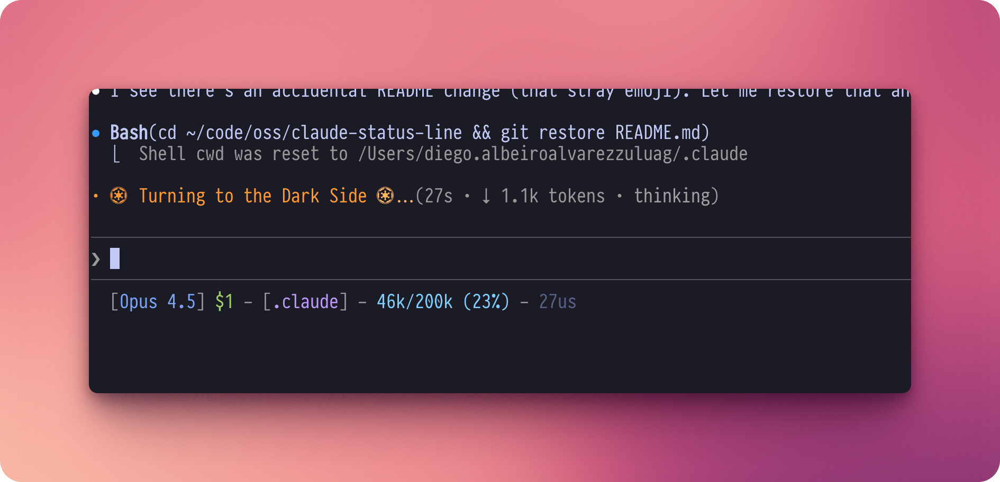

# claude-status-line

A fast Rust binary for rendering Claude Code's status line with Tokyo Night colors.



## Why?

Life's too short for slow status lines.

The bash version spawns 7 `jq` processes per render (121ms). This Rust version parses JSON once and gets out of your way. Same output, 9-17x faster, **zero process spawning**.

### Zero External Commands

Most tools shell out to `git` for repo info. Each `git` call costs ~8ms in fork/exec overhead. We read git's internal files directly - in-process, no spawning:

| Info | Traditional (~8ms each) | This Tool (~5us) |
|------|-------------------------|------------------|
| Repo name | `git rev-parse --show-toplevel` | Read `.git` file |
| Branch | `git rev-parse --abbrev-ref HEAD` | Read `.git/HEAD` |
| Worktree | `git rev-parse --git-dir` | Parse `.git` gitdir pointer |

**Result**: Git info in microseconds, not milliseconds. Three git commands would add ~24ms; we add ~15us.

> **Note**: Yes, this is overengineered. No, a status line doesn't need to be this fast. But optimizing things that don't need optimizing is fun, and mass:time ratio matters.

### Benchmark (hyperfine, 100 runs)

**Apple M1 Max**:

| Command | Mean [ms] | Min [ms] | Max [ms] | Relative |
|:---|---:|---:|---:|---:|
| Bash + jq (7 calls) | 121.1 ± 6.8 | 103.7 | 145.0 | 9.17 ± 1.46 |
| Rust binary | 13.2 ± 2.0 | 9.4 | 19.7 | 1.00 |

**Apple M4 Pro**:

| Command | Mean [ms] | Min [ms] | Max [ms] | Relative |
|:---|---:|---:|---:|---:|
| Rust binary | 7.1 ± 1.4 | 5.0 | 13.5 | 1.00 |

See `statusline.sh.example` for the original bash implementation.

## Install

### Pre-built Binaries

Download from [Releases](https://github.com/d1egoaz/claude-status-line/releases):

| Platform | File |
|----------|------|
| Linux x64 | `statusline-x86_64-unknown-linux-gnu.tar.gz` |
| macOS Intel | `statusline-x86_64-apple-darwin.tar.gz` |
| macOS ARM | `statusline-aarch64-apple-darwin.tar.gz` |
| Windows x64 | `statusline-x86_64-pc-windows-msvc.zip` |

### Build from Source

Requires Rust. Install via [rustup](https://rustup.rs/) or your package manager.

```bash
# Build release binary
cargo build --release

# Or with just (https://github.com/casey/just)
just build
```

Binary outputs to `target/release/statusline`.

## Usage

Configure in `~/.claude/settings.json`:

```json
{
  "statusLine": {
    "type": "command",
    "command": "/path/to/statusline",
    "padding": 0
  }
}
```

## Example Output

```
[Opus 4.5] $1 - [my-project:main] - 46k/200k (23%) - 27us
~/code/oss/my-project
```

| Field | Color | Description |
|-------|-------|-------------|
| `[Opus 4.5]` | Blue | Current model name |
| `$1` | Green/Yellow/Orange | Session cost (green $0-5, yellow $6-20, orange $21+) |
| `[my-project:main]` | Purple | Git repo and branch (detects worktrees) |
| `46k/200k (23%)` | Cyan | Context tokens used / total available |
| `27us` | Gray | Status line render time (microseconds) |
| `~/code/...` | Gray | Working directory path (~ for home) |

Colors use the [Tokyo Night](https://github.com/enkia/tokyo-night-vscode-theme) palette.

## Development

```bash
just          # List available commands
just build    # Build release binary
just try      # Test with sample JSON
just lint     # Run clippy (requires clippy)
just fmt      # Format code
```

## Releasing

To create a new release:

```bash
# 1. Update version in Cargo.toml
# 2. Commit the version bump
git add Cargo.toml Cargo.lock
git commit -m "chore: bump version to vX.Y.Z"

# 3. Create and push tag
git tag vX.Y.Z -m "Description of release"
git push origin main --tags
```

GitHub Actions will automatically build binaries for all platforms and create a release.

## License

MIT
